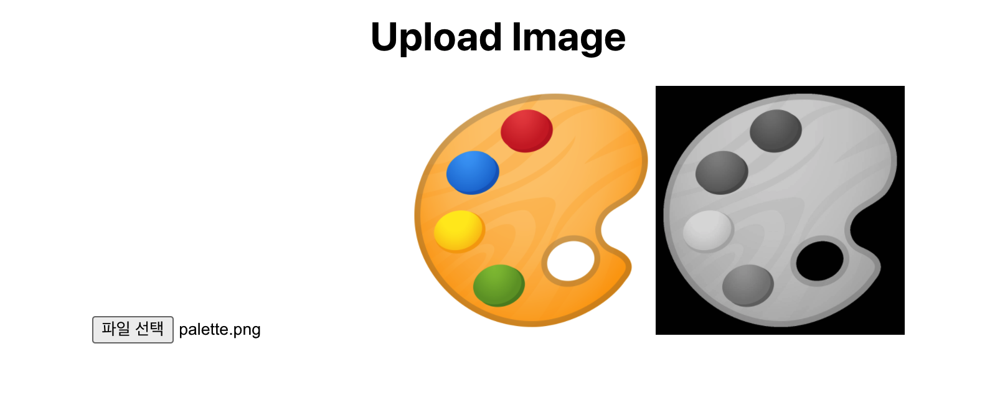
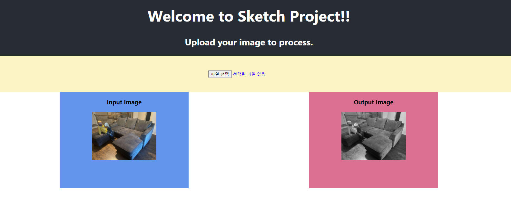
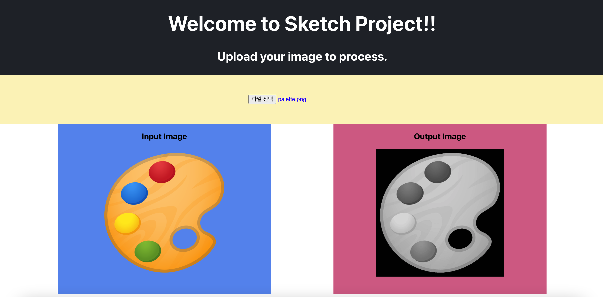

# Sketch App Project

## (3주차) React -> Flask 서버 이미지 업로드 구현
* React frontend 에서 Flask backend로 이미지 POST (Request)
* Flask backend 에서 받은 이미지를 흑백으로 변환하여 React frontend 로 반환 (Response)
* React front 에서 flask backend 로부터 받아온 이미지를 웹 화면에 띄우기 

<p align="center">  </p>

## (4주차) CSS 연습 & MobX 실습
* (미완) CSS / styled-components 활용 웹페이지 꾸미기

<p align="center">  </p>

## (5~6주차) CSS 연습 & MobX 실습
* MobX 적용 : 기존 State 치환

<p align="center">  </p>
---

> **실행시키기**
* 백엔드 실행
```bash
git clone --branch daniel https://github.com/ydjoo/Sketch.git

cd Sketch
python main.py
```
* 프론트 실행
```bash
#새로운 터미널을 켜고 'Sketch' 폴더에서 시작.
cd my-react-app
npm start
```