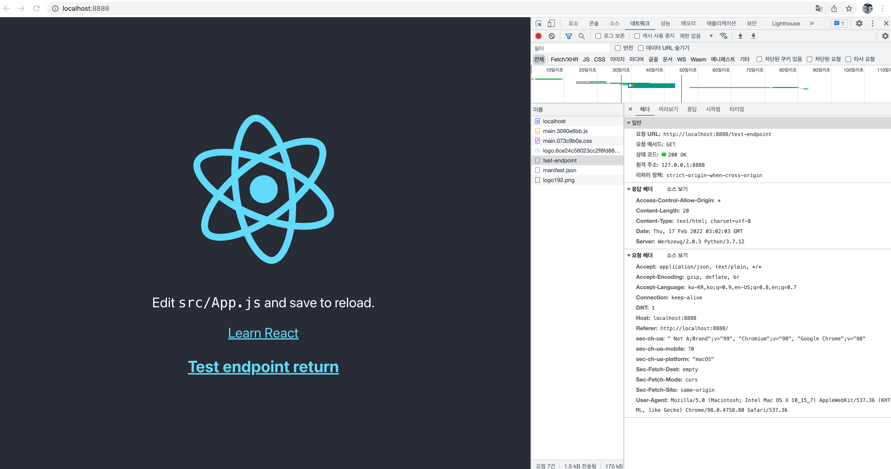

# React App을 Flask에 올려보기 (리액트 앱 호스팅 및 백엔드)

기존 프로젝트였던 https://github.com/kimsehwan96/react-with-flask 의 경우, 

`npm run eject`를 해야하는 위험 부담이 있었음. 따라서 `npm run eject`를 하지 않아도 

Flask를 통해 `build`된 리액트 앱을 올림과 동시에, 백엔드 역할까지 수행 가능하도록 제작한 일종의 boilerplate.

## 디렉터리 구조
```text
.
├── main.py # 간단한 백엔드 엔드포인트 한개와, 리액트앱을 호스팅할 Flask 진입점 코드
└── my-react-app/ # 여러분의 리액트 프로젝트로 대체하면 됩니다.  
    └── build/   # build 된 react app 
```

## main.py 구조

```python3
import os
from flask import Flask, send_from_directory
from flask_cors import CORS
from threading import Lock

async_mode = None
app = Flask(__name__, static_folder='my-react-app/build') # Change your react-app name 'my-react-app'
app.config['SECRET_KEY'] = 'secret!'
thread_lock = Lock()
CORS(app)

@app.route('/', defaults={'path': ''})
@app.route('/<path:path>')
def serve(path):
    if path != "" and os.path.exists(app.static_folder + '/' + path):
        return send_from_directory(app.static_folder, path)
    else:
        return send_from_directory(app.static_folder, 'index.html')

@app.route('/test-endpoint', methods=['GET'])
def test():
    return "Test endpoint return"

if __name__ == '__main__':
    app.run(host='localhost', port=8888, debug=True) # You can change port, host..
```

`/test-endpoint` 라는 `localhost:8888/test-endpoint` 를 호출했을경우 받을 간단한 응답을 주는 엔드포인트 코드와

실제로 리액트 앱(빌드 된 것)을 호스팅하기 위한 코드가 작성되어있다.

```python3
@app.route('/', defaults={'path': ''})
@app.route('/<path:path>')
def serve(path):
    if path != "" and os.path.exists(app.static_folder + '/' + path):
        return send_from_directory(app.static_folder, path)
    else:
        return send_from_directory(app.static_folder, 'index.html')
```

(위 부분이 리액트 앱을 호스팅하기 위한 부분)

리액트 앱은 `npx create-react-app my-react-app` 을 통해 만들었고, 리액트 앱을 호스팅할 플라스크의 endpoint를 호출하기위해서

다음과 같이 `App.js`를 임의로 작성하였다.

```jsx
import logo from './logo.svg';
import './App.css';
import React, { useState, useEffect } from 'react';
import axios from 'axios';


function App() {
  const [testData, setTestData] = useState(null);
  useEffect(() => {
    const testFetch = async() => {
      try {
        const response = await axios.get('http://localhost:8888/test-endpoint');
        setTestData(response.data);
        console.log(response.data)
      } catch (e) {
        console.error(e)
      }
    };
    testFetch();
  }, [])
  return (
    <div className="App">
      <header className="App-header">
        
        <p>
          Edit <code>src/App.js</code> and save to reload.
        </p>
        <a
          className="App-link"
          href="https://reactjs.org"
          target="_blank"
          rel="noopener noreferrer"
        >
          Learn React

          <h3>
            {testData}
          </h3>

        </a>
      </header>
    </div>
  );
}

export default App;

```

## 실제 결과

1. `my-react-app` 디렉터리에 들어가 `yarn build` 진행
2. 이후 `python3 main.py` 로 플라스크 앱 실행 (호스팅 + 백엔드)
3. `localhost:8888` 접속



